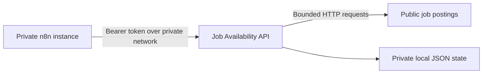

# Job Availability API

[](https://github.com/orbruno/job-availability-api/actions/workflows/ci.yml)
[](LICENSE.md)
[](package.json)

Job Availability API is a local-first, single-operator TypeScript service for deterministic job-posting observation and durable availability runs. It provides the authenticated `/v1` API used by [`n8n-nodes-job-availability`](https://github.com/orbruno/n8n-nodes-job-availability).

Status: public-source release candidate for private self-hosting. The API is not a hosted service, does not require a public endpoint, and is not designed for multi-tenant or public-internet deployment.

## Capabilities

- Observe a public job posting without first registering it.
- Manage durable availability runs over a separately maintained job inventory.
- Classify availability deterministically without model inference.
- Require bearer authentication and mutation idempotency.
- Reject unsafe outbound targets at URL, redirect, DNS, and connection boundaries.
- Persist compatible JSON state through one local writer with atomic recovery.
- Emit bounded, privacy-safe operational signals.

The frozen OpenAPI 3.1.1 contract exposes nine authenticated operations. See the [API contract](openapi/job-availability-v1.yaml) and [architecture](docs/architecture.md).

## Deployment model



The API may remain entirely private. It needs outbound access to the public posting URLs being checked, while only n8n needs inbound access to the API.

## Quick start with Docker Compose

Prerequisites: Docker with Compose, Node.js 22.22.0 or newer for token generation, and an unused local port 5002.

```sh
git clone https://github.com/orbruno/job-availability-api.git
cd job-availability-api
mkdir -p .secrets
umask 077
node scripts/generate-token.mjs > .secrets/job-availability-token
chmod 600 .secrets/job-availability-token
cp .env.example .env
```

Set `JOB_AVAILABILITY_COMPOSE_TOKEN_FILE` in `.env` to the absolute path of the token file. Before first startup, verify how the Docker engine mounts its ownership and permissions:

```sh
docker compose run --rm --no-deps --entrypoint stat job-availability -c '%a %u %g %F' /run/secrets/job-availability-token
```

The expected result is `600 1000 1000 regular file`. Stop if it differs; the service intentionally refuses weak or ambiguous secret-file permissions.

Start and verify the service:

```sh
docker compose up --build -d
docker compose ps
docker compose exec job-availability node scripts/healthcheck.mjs
```

Compose publishes the API only on host loopback at `127.0.0.1:5002`. The named data volume is retained when the container is recreated.

## Connect n8n

Install the community node from its [source repository](https://github.com/orbruno/n8n-nodes-job-availability), then create a **Job Availability API** credential using the same token.

Choose the Base URL for the actual network topology:

- n8n running directly on the same host: `http://127.0.0.1:5002`
- n8n and this service on a shared Docker network: `http://job-availability:5002`
- n8n in a separate container: connect both services to a private shared network; do not use the n8n container's `127.0.0.1`

See [private n8n connectivity](docs/n8n-connectivity.md) for Docker examples and boundary guidance.

### Deterministic demonstration posting

Use the repository's [public synthetic posting](docs/demo-posting.html) when a repeatable installation or integration demonstration must not depend on a third-party job board:

```text
https://raw.githubusercontent.com/orbruno/job-availability-api/main/docs/demo-posting.html
```

Expected title: `Synthetic Data Engineer`. Expected company: `Example Organization`. The fixture contains synthetic data only and is not production availability evidence.

## Stateless and durable use

Posting **Observe** works without a stored job inventory. Durable run and job operations require a compatible `jobs/index.json` plus one `metadata.json` per registered job. The API intentionally does not own job discovery or registration.

See [data layout](docs/data-layout.md) before enabling durable operations. Never point an evaluation instance at production data, and never run two availability writers against the same data root.

## Local development

Use Node.js 24.19.0 and npm 11.6.2 for the reproducible development toolchain:

```sh
npm ci --ignore-scripts
npm run check
npm run smoke:runtime
```

The complete gate runs linting, strict type-checking, OpenAPI/schema/fixture validation, 245 tests, a production build, and an isolated authenticated runtime smoke test. Tests write only to temporary data roots.

## Documentation

- [Operations](docs/operations.md)
- [Private n8n connectivity](docs/n8n-connectivity.md)
- [Deterministic demonstration posting](docs/demo-posting.html)
- [Data layout](docs/data-layout.md)
- [Architecture](docs/architecture.md)
- [Threat model](docs/threat-model.md)
- [Backup and restore](docs/backup-and-restore.md)
- [Rollback](docs/rollback.md)
- [Roadmap](ROADMAP.md)
- [Security policy](SECURITY.md)

## Support and contributions

Use [GitHub Issues](https://github.com/orbruno/job-availability-api/issues) for reproducible bugs and bounded feature proposals. Read [CONTRIBUTING.md](CONTRIBUTING.md) before submitting a change. Report vulnerabilities privately according to [SECURITY.md](SECURITY.md).

## License

MIT. See [LICENSE.md](LICENSE.md).
