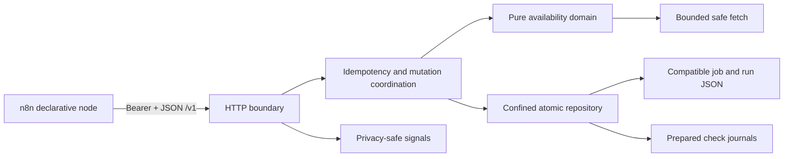

# Architecture

Version: 1.0

The Job Availability service is a local, single-operator TypeScript process. It implements the frozen `/v1` contract and preserves version 1 JSON documents across compatible releases. The service is not a scheduler: n8n owns schedule, batching, branching, notification, and workflow retry.

The HTTP boundary rejects duplicate security-relevant headers, performs authentication before the single authenticated-operator rate limit, caps connections, headers, and bodies, validates JSON with the frozen schemas, and emits RFC 9457 problem documents. Every POST has a global operator-scoped idempotency key. A digest-only admission is durably reserved before the operation and expires exactly 24 hours later; its committed result uses the same expiry. Active processes prune expired state at startup and at bounded 15-minute maintenance intervals.

The application boundary uses one FIFO mutation coordinator for run, job, failure, cancellation, finalization, pruning, and recovery mutations. Fetching occurs outside the lock. Commit re-enters the lock and reloads the run; a completed cancellation therefore wins and cannot be overwritten by stale work.

A successful check changes three compatible documents. The repository first atomically writes a prepared journal containing the intended availability, evidence, and run result. It then rolls those documents forward and removes the journal only after durable directory synchronization. Startup rolls forward every valid prepared journal before serving traffic. Each write is idempotent, so an interruption at any boundary is restart-safe.

The sole-writer lock is exclusive and persisted below the availability root. Graceful shutdown releases it. A crash-stale lock is never removed automatically: recovery requires its exact owner, the same host identity, and proof from the operating system that the recorded PID does not exist. A separate exclusive recovery guard prevents two recovery attempts; if recovery itself crashes, the guard remains for explicit incident review.

The outbound adapter validates HTTP(S) syntax and credentials, resolves every initial and redirect host, rejects any mixed unsafe address set, and repeats the policy in the connection lookup. It preserves the original Host header and TLS server name, handles redirects manually, bounds decoded content to 2 MiB, applies a 15-second total deadline, permits one eligible retry, spaces starts by at least one second per host, and admits at most four concurrent source checks per service process.

Default host binding is `127.0.0.1`. Compose binds the process to its private container interface while publishing port 5002 only on host loopback.

Telemetry uses a fixed redacted allowlist. Its JSON-lines sink drops output while the stream is backpressured and permanently contains stream errors, so a broken collector cannot change a domain response or terminate the service.
